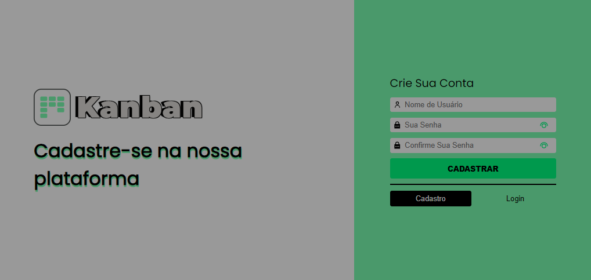
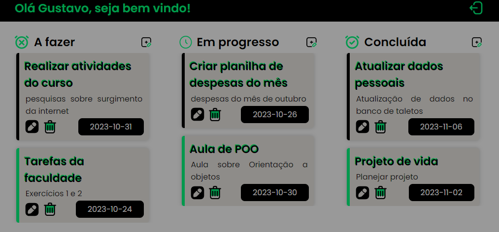

<h1 align="center"> Projeto Kanban </h1>

Sistema completo de gerenciamento de tarefas. Feito especialmente para satisfazer as necessidades de organização que você precisa! 

 

  

  

## 🚀 Tecnologias

Esse projeto foi desenvolvido com as seguintes tecnologias:

- HTML e CSS
- JavaScript
- Git e Github

## 💻 Projeto

O projeto Kanban foi desenvolvido pelos alunos da ADA Tech, no final do módulo de JS Vanilla. Desenvolvido para atender aos usuário que gostam de organizar suas tarefas diarias no estilo Kanban.

## Créditos

Feito por:
 Dário Klein, Luis Guilherme Vieira Neves, Gustavo de Sousa Lima e João Ribeiro.
